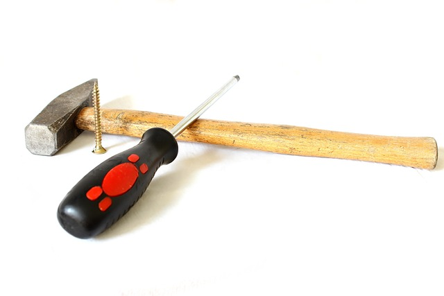

OpenBook: Interactive Online Textbooks
======================================

1. [Welcome to OpenBook](#welcome-to-openbook)
1. [Copyright](#copyright)

Under Construction
------------------

   <!-- https://pixabay.com/photos/screwdriver-background-screw-wooden-1008974/ -->
   

Hang on. This project is still in early stages, under heavy development. The project is deliberately
made open-source from the beginning to assist developers and others interested in joining the project
to document our vision what has already been built. Stay tuned until the first version is released or
better yet, join us in shaping the future of education.

Welcome to OpenBook
-------------------

OpenBook is more than just a tool: it's a **personal learning companion** for students and a
**powerful teaching assistant** for educators. Designed by educators and students for students
and educators, it redefines how we learn, teach, and engage with knowledge.

### For Learners

OpenBook acts as your **personal lecturer**, guiding you through your learning journey. It doesn't
just answer questions. It actively supports you by:

* Curating and organizing learning materials tailored to your needs.
* Monitoring your progress and suggesting interactive activities to help you meet your goals.
* Helping you prepare questions for your teachers and connect with fellow learners.

### For Teachers & Lecturers

One could say, OpenBook is your traditional learning management system reimagined in the 21st century.
But OpenBook is much more than that. OpenBook serves as your always available **teaching assistant**,
supporting the entire teaching lifecycle:

* Structuring and presenting content – the core of OpenBook's functionality.
* supporting student self-studies,
* running interactive exercises,
* answering student questions,
* providing detailed progress reports,
* and much more

### Interactive Learning, Redefined

At the heart of OpenBook are **highly interactive online textbooks**, blending the best of traditional
print with modern multimedia. Courses built around these textbooks are enhanced by OpenBook's
**built-in learning model and AI assistant**, which doesn't just respond to prompts but drives the
entire learning experience.

### Free, Open, and for Everyone

OpenBook is **100% Free and Libre Software**. No exceptions, no excuses. We believe education --- and
the technology that powers it --- should be accessible to everyone, with no exceptions. There are no
premium versions or hidden paywalls. OpenBook is fully open-source, available for anyone to
download, install, and use **without restrictions**.

Copyright
---------

OpenBook: Interactive Online Textbooks  
© 2024 – 2026 Dennis Schulmeister-Zimolong <dennis@wpvs.de>  

This program is free software: you can redistribute it and/or modify
it under the terms of the GNU Affero General Public License as
published by the Free Software Foundation, either version 3 of the
License, or (at your option) any later version.

In the year 2025 development was in part funded by the KoLLI research
project at DHBW Karlsruhe.
