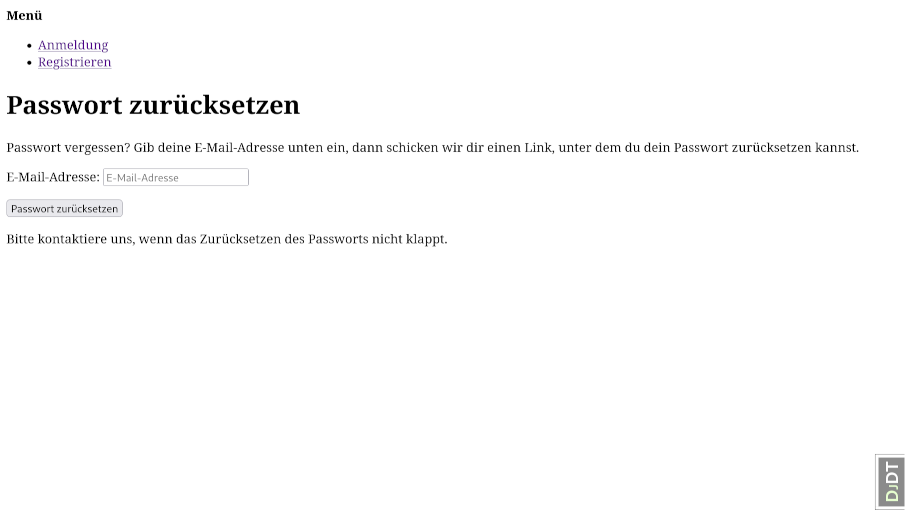
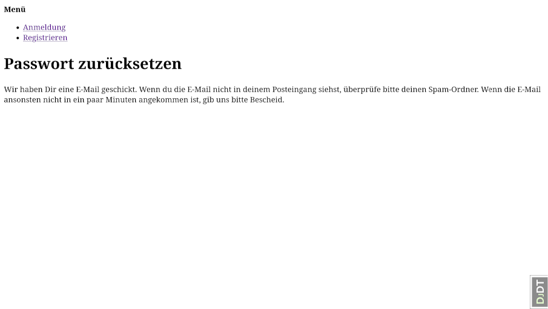
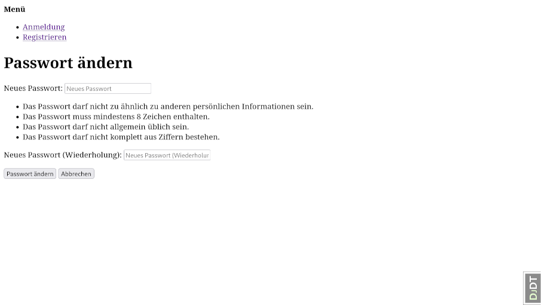

Basic Account Management
========================

This document describes the basic account management processes like signup
or password reset.

1. [Signup for a new local account](#signup-for-a-new-local-account)
    1. [Signup form](#signup-form)
    1. [Confirmation sent](#confirmation-sent)
    1. [Confirm e-mail address](#confirm-e-mail-address)
1. [Reset forgotten password](#reset-forgotten-password)
    1. [Enter e-mail address](#enter-e-mail-address)
    1. [Password reset code sent](#password-reset-code-sent)
    1. [Enter new password](#enter-new-password)
    1. [Password reset confirmed](#password-reset-confirmed)

Signup for a new local account
------------------------------

### Signup form

* URL: `/accounts/signup/`
* Should show a message for invalid data. But default template simply rerenders without message?


__API: Signup__

```http
POST /auth-api/browser/v1/auth/signup HTTP/1.1
Origin: http://localhost:8000
X-Csrftoken: cQKGBJEFPHCwSr9ZKgipmL4leUtwO4F7
Content-Type: application/json
Host: localhost:8000
Content-Length: 90

{
  "email": "test1@example.com",
  "username": "JoeStudent",
  "password": "TopSecret!"
}
```

Status code 401: Verification pending

The list of possible flows contains `verify_email` (or `verify_phone`) to indicate that a
verification message has been sent. The user must click the link the message to proceed.

```json
{
  "status": 401,
  "data": {
    "flows": [
      {
        "id": "login"
      },
      {
        "id": "login_by_code"
      },
      {
        "id": "signup"
      },
      {
        "id": "provider_redirect",
        "providers": [
          "urn:mocksaml.com"
        ]
      },
      {
        "id": "verify_email",
        "is_pending": true
      }
    ]
  },
  "meta": {
    "is_authenticated": false
  }
}
```

### Confirmation sent

* URL: `/accounts/confirm-email/`
* This appears after successful signup when the confirmation mail has been sent.


E-Mail message:

```mime
Content-Type: text/plain; charset="utf-8"
Content-Transfer-Encoding: quoted-printable
MIME-Version: 1.0
Subject: [OpenBook] Please Confirm Your Email Address
From: noreply@example.com
To: test1@example.com
Date: Thu, 23 Apr 2026 21:23:10 +0000
Message-ID: <177697939000.21515.10631817803009409766@vancouver>

Hello from OpenBook!

You're receiving this email because user JoeStudent has given your email addr=
ess to register an account on openbook.studio.

To confirm this is correct, go to http://localhost:8000/accounts/confirm-emai=
l/MTI:1wG1Vt:krNeEhFxFN7qRIIdpJP6OY5t_N0FqKXHH-U4BlJoHHM/

Thank you for using OpenBook!
openbook.studio
```

__Note:__ We need to find out how to customize the link in the message, since
the link above will not open the frontend SPA but renders on the backend.

### Confirm e-mail address

* URL: `/accounts/confirm-email/Mw:1w6v4v:Ns2nPgP099lhnDlhhFcbGSmUeC_pvadjWpL9wQgntak/`
* This is the link from the conformation mail. It shows the following screen.


__API: Verify e-mail address__

```http
POST /auth-api/browser/v1/auth/email/verify HTTP/1.1
Origin: http://localhost:8000
X-Csrftoken: cQKGBJEFPHCwSr9ZKgipmL4leUtwO4F7
Content-Type: application/json
Host: localhost:8000
Content-Length: 69

{
  "key": "MTI:1wG1Vt:krNeEhFxFN7qRIIdpJP6OY5t_N0FqKXHH-U4BlJoHHM"
}
```

Status code 401: Relogin needed

Depending on the backend settings the user could now be logged in (status 200) or need to
relogin with the verified credentials (status 401). All other status values (400 and 409)
indicate different types of errors.

```json
{
  "status": 401,
  "data": {
    "flows": [
      {
        "id": "login"
      },
      {
        "id": "login_by_code"
      },
      {
        "id": "signup"
      },
      {
        "id": "provider_redirect",
        "providers": [
          "urn:mocksaml.com"
        ]
      }
    ]
  },
  "meta": {
    "is_authenticated": false
  }
}
```

Reset forgotten password
------------------------

### Enter e-mail address

* URL: `/accounts/password/reset/`



__API: Request password reset e-mail__

```http
POST /auth-api/browser/v1/auth/password/request HTTP/1.1
Origin: http://localhost:8000
X-Csrftoken: cQKGBJEFPHCwSr9ZKgipmL4leUtwO4F7
Content-Type: application/json
Host: localhost:8000
Content-Length: 33

{
  "email": "test@student.com"
}
```

Status code 200: Reset mail sent

```http
{
  "status": 200
}
```

### Password reset code sent

* URL: `/accounts/password/reset/done/`



```mime
Content-Type: text/plain; charset="utf-8"
Content-Transfer-Encoding: quoted-printable
MIME-Version: 1.0
Subject: [OpenBook] Password Reset Email
From: noreply@example.com
To: test@student.com
Date: Thu, 23 Apr 2026 21:31:01 +0000
Message-ID: <177697986167.21515.1651587689942989243@vancouver>

Hello from OpenBook!

You're receiving this email because you or someone else has requested a passw=
ord reset for your user account.
It can be safely ignored if you did not request a password reset. Click the l=
ink below to reset your password.

http://localhost:8000/accounts/password/reset/key/8-d7ibrp-f365d50265a05719f5=
96b470f54cd050/

In case you forgot, your username is test6.

Thank you for using OpenBook!
openbook.studio
```

__Note:__ Again, we need to find out how to customize the link in the e-mail.

### Enter new password

* URL: `http://localhost:8000/accounts/password/reset/key/3-d67wfn-a143457b77188c729666b544a75b7ef7/`
* This is the link from the reset password mail. It shows the following screen.
* Shows additional messages at the top, when an invalid password is chosen.



__API: Reset password__

```http
POST /auth-api/browser/v1/auth/password/reset HTTP/1.1
Origin: http://localhost:8000
X-Csrftoken: cQKGBJEFPHCwSr9ZKgipmL4leUtwO4F7
Content-Type: application/json
Host: localhost:8000
Content-Length: 86

{
  "key": "8-d7ibrp-f365d50265a05719f596b470f54cd050",
  "password": "The-X-Files!"
}
```

Status code 401: Relogin needed

As always, status code 200 means, the user is logged in and 401 is the user is not logged in.
Other status codes indicate errors. The actuall JSON-response gives no usable information.

```json
{
  "status": 401,
  "data": {
    "flows": [
      {
        "id": "login"
      },
      {
        "id": "login_by_code"
      },
      {
        "id": "signup"
      },
      {
        "id": "provider_redirect",
        "providers": [
          "urn:mocksaml.com"
        ]
      }
    ]
  },
  "meta": {
    "is_authenticated": false
  }
}
```

### Password reset confirmed

* URL: `/accounts/password/reset/key/done/`


