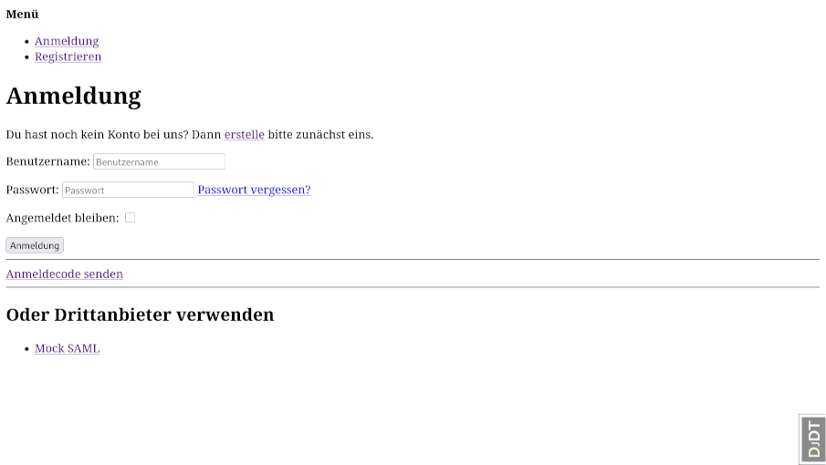

Basic Login/Logout with Local Accounts
======================================

This document describes the different login and logout flows for regular local
user accounts. This is the core functionality that is also underlying social
login and SAML integration.

1. [Login with local account](#login-with-local-account)
1. [Login via e-mail one-time code](#login-via-e-mail-one-time-code)
    1. [Request code](#request-code)
    1. [Enter code](#enter-code)
1. [Logout](#logout)

Login with local account
------------------------

* URL: `/accounts/login/?next=%2Fadmin%2F`
* The `next` parameter contains the path to redirect to after successful login.
* Should show a message for invalid data. But default template simply rerenders without message?



__API: Get Configuration__

```http
GET /auth-api/browser/v1/config HTTP/1.1
Host: localhost:8000
```

Status Code 200:

```json
{
  "status": 200,
  "data": {
    "account": {
      "login_methods": [
        "username"
      ],
      "is_open_for_signup": true,
      "email_verification_by_code_enabled": false,
      "login_by_code_enabled": true,
      "password_reset_by_code_enabled": false,
      "authentication_method": "username"
    },
    "socialaccount": {
      "providers": [
        {
          "id": "urn:mocksaml.com",
          "name": "Mock SAML IdP",
          "flows": [
            "provider_redirect"
          ]
        }
      ]
    }
  }
}
```

__API: Get Authentication Status__

This should be called on application start-up to check, if the user is already logged in
and get the username to display. It may be called later to find out, if the user is still
logged in. To keep bandwidth low, it should be called:

1. When the SPA starts
1. When another API call fails
1. In a timer every five minutes
    - Site-wide admin setting for the interval
    - Site-wide admin setting to disable the timer (intervall = 0)

```http
GET /auth-api/browser/v1/auth/session HTTP/1.1
Host: localhost:8000
```

Status Code 401: Most API requests give this response, when not logged in

```json
{
  "status": 401,
  "data": {
    "flows": [
      {
        "id": "login"
      },
      {
        "id": "login_by_code"
      },
      {
        "id": "signup"
      },
      {
        "id": "provider_redirect",
        "providers": [
          "urn:mocksaml.com"
        ]
      }
    ]
  },
  "meta": {
    "is_authenticated": false
  }
}
```

Status Code 200: When logged in

```json
{
  "status": 200,
  "data": {
    "user": {
      "id": 1,
      "display": "dennis",
      "email": "dennis@windows3.de",
      "has_usable_password": true,
      "username": "dennis"
    },
    "methods": [
      {
        "method": "password",
        "at": 1774874642.713197,
        "username": "dennis"
      }
    ]
  },
  "meta": {
    "is_authenticated": true
  }
}
```

__API: Login with username and password___

```http
POST /auth-api/browser/v1/auth/login HTTP/1.1
Origin: http://localhost:8000
X-Csrftoken: GLoSq53DnTfY99cwkRIE3PS08qA0OJip
Content-Type: application/json
Host: localhost:8000
Content-Length: 60

{
  "username": "Unknown user",
  "password": "TopSecret!"
}
```

Status code 400: Invalid username or password

```json
{
  "status": 400,
  "errors": [
    {
      "message": "The username and/or password you specified are not correct.",
      "code": "username_password_mismatch",
      "param": "password"
    }
  ]
}
```

Status code 200: Login successful

```json
{
  "status": 200,
  "data": {
    "user": {
      "id": 1,
      "display": "dennis",
      "email": "dennis@windows3.de",
      "has_usable_password": true,
      "username": "dennis"
    },
    "methods": [
      {
        "method": "password",
        "at": 1774874642.713197,
        "username": "dennis"
      }
    ]
  },
  "meta": {
    "is_authenticated": true
  }
}
```

Login via e-mail one-time code
------------------------------

### Request code

* URL: `/accounts/login/code/`


__API: Request code for email__

```http
POST /auth-api/browser/v1/auth/code/request HTTP/1.1
Origin: http://localhost:8000
X-Csrftoken: rgSxJU7NYCmOzV6c03pGQcgWLsKYMlTf
Content-Type: application/json
Host: localhost:8000
Content-Length: 31

{
  "email": "test@admin.com"
}
```

Instead of `"email"` a code can also be requested for a phone number via the
`"phone"` property, but not for both at the same time.

Status code 401: Unauthorized (code was sent)

A bit counterintuitively status code 401 will also be sent, when the request was
actually sucessfull and a one-time login code has been sent to the e-mail address.
This endpoint only returns status 400 (error) or 401 (not authenticated).

```json
{
  "status": 401,
  "data": {
    "flows": [
      {
        "id": "login"
      },
      {
        "id": "login_by_code",
        "is_pending": true
      },
      {
        "id": "signup"
      },
      {
        "id": "provider_redirect",
        "providers": [
          "urn:mocksaml.com"
        ]
      }
    ]
  },
  "meta": {
    "is_authenticated": false
  }
}
```

### Enter/Confirm code

* URL: `/accounts/login/code/confirm/`
* Show a message when an invalid code is entered.


__API: Login with code__

```http
POST /auth-api/browser/v1/auth/code/confirm HTTP/1.1
Origin: http://localhost:8000
X-Csrftoken: VkEDcfF3zvULj9PZ3e1ZfvU53QoE90s8
Content-Type: application/json
Host: localhost:8000
Content-Length: 25

{
  "code": "TTHD-HGMP"
}
```

Status code 200: Login successful

```json
{
  "status": 200,
  "data": {
    "user": {
      "id": 11,
      "display": "test9",
      "email": "test@admin.com",
      "has_usable_password": false,
      "username": "test9"
    },
    "methods": [
      {
        "method": "code",
        "at": 1776971187.9882576,
        "email": "test@admin.com"
      }
    ]
  },
  "meta": {
    "is_authenticated": true
  }
}
```

Status 409 means, that the login was unsuccessful, e.g. because the token expired
or the user is already logged in.

Logout
------

* URL: `/accounts/logout/`
* Redirects to `/` after logout.


__API: Logout__

```http
DELETE /auth-api/browser/v1/auth/session HTTP/1.1
Origin: http://localhost:8000
X-Csrftoken: rgSxJU7NYCmOzV6c03pGQcgWLsKYMlTf
Host: localhost:8000
```

Status code 401: Successfully logged out.

Note: The response is always the same, no matter if the user was logged in before.

```json
{
  "status": 401,
  "data": {
    "flows": [
      {
        "id": "login"
      },
      {
        "id": "login_by_code"
      },
      {
        "id": "signup"
      },
      {
        "id": "provider_redirect",
        "providers": [
          "urn:mocksaml.com"
        ]
      }
    ]
  },
  "meta": {
    "is_authenticated": false
  }
}
```
