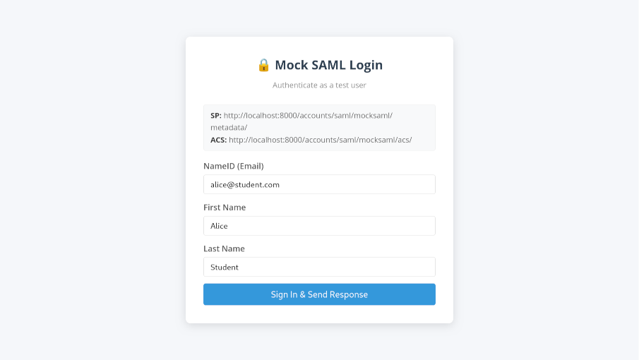

Social login and SAML integration
=================================

This document describes the extensions beyond basic account management and
basic login and logout to allow sign-up and login with different identity
Providers (IdP).

1. [Login via SAML-based identity provider](#login-via-saml-based-identity-provider)
    1. [Begin flow](#begin-flow)
    1. [IdP login form](#idp-login-form)
    1. [Confirm e-mail](#confirm-e-mail)

Login via SAML-based identity provider
--------------------------------------

### Begin flow

* URL: `/accounts/saml/mocksaml/login/?process=login`
* The SAML provider has already been chosen before starting the process.
* Clicking the button redirects the client to the IdP login page.


__API: Get Configuration__

The following call returns the configuration including available identity providers.

```http
GET /auth-api/browser/v1/config HTTP/1.1
Origin: http://localhost:8000
X-Csrftoken: VkEDcfF3zvULj9PZ3e1ZfvU53QoE90s8
Host: localhost:8000
```

Status code 200: Configuration returned

```json
{
  "status": 200,
  "data": {
    "account": {
      "login_methods": [
        "username"
      ],
      "is_open_for_signup": true,
      "email_verification_by_code_enabled": false,
      "login_by_code_enabled": true,
      "password_reset_by_code_enabled": false,
      "authentication_method": "username"
    },
    "socialaccount": {
      "providers": [
        {
          "id": "urn:mocksaml.com",
          "name": "Mock SAML IdP",
          "flows": [
            "provider_redirect"
          ]
        }
      ]
    }
  }
}
```

### IdP login form



__API: Redirect to identity provider__

To start the login flow, a form POST request must be initiated (no AJAX), sending the identity
provider id and a callback url to the backend. The server will respond with a redirect to make
the browser automatically load the identity provider login page.

The `process` parameter must be set to `login` to allow login into an existing account or
creating a new account, if it doesn't already exist. `process=connect` would be used to add
another IdP to the same account (which we don't support).

Note, that the callback URL is not the callback URL registered with the identity provider.
It is a frontend endpoint to call, after the external part of the login flow has finished.
The frontend must then check the login status to see, if the user is logged in or a new flow
like e-mail validation starts.

```http
POST /auth-api/browser/v1/auth/provider/redirect HTTP/1.1
Origin: http://localhost:8000
X-Csrftoken: cQKGBJEFPHCwSr9ZKgipmL4leUtwO4F7
Content-Type: application/x-www-form-urlencoded
Host: localhost:8000
Content-Length: 93

callback_url=http%3A%2F%2Flocalhost%3A8000%2Fapp%2F&process=login&provider=urn%3Amocksaml.com
```

Status code 302: Redirect

```http
HTTP/1.1 302 Redirect
Location: http://localhost:8886/sso?SAMLRequest=...
```

### Confirm e-mail

* URLs: `/accounts/confirm-email/` and `/accounts/confirm-email/.../`
* After the first login, the e-mail address must be verified.
* This is the exact same flow as when signing up for a local account (see below).


__API: Get authentication status__

After returning from the IdP, the app must call the get authentication status endpoint
to check if the user is already logged in or another flow like e-mail verification
shall be started.

```http
GET /auth-api/browser/v1/auth/session HTTP/1.1
Origin: http://localhost:8000
X-Csrftoken: cQKGBJEFPHCwSr9ZKgipmL4leUtwO4F7
Host: localhost:8000
```

Below example does not quite fit. The flows would normally include values such as
`verify_email`.

```json
{
  "status": 401,
  "data": {
    "flows": [
      {
        "id": "login"
      },
      {
        "id": "login_by_code"
      },
      {
        "id": "signup"
      },
      {
        "id": "provider_redirect",
        "providers": [
          "urn:mocksaml.com"
        ]
      }
    ]
  },
  "meta": {
    "is_authenticated": false
  }
}
```
